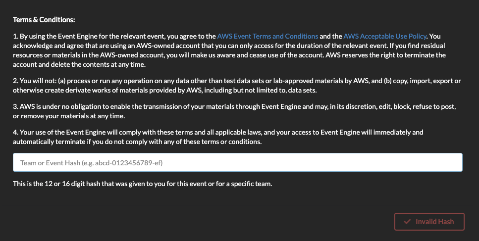
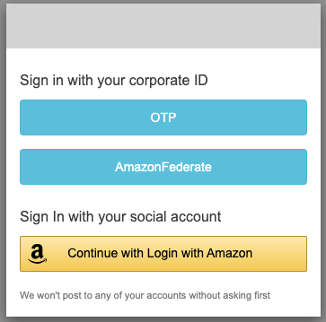
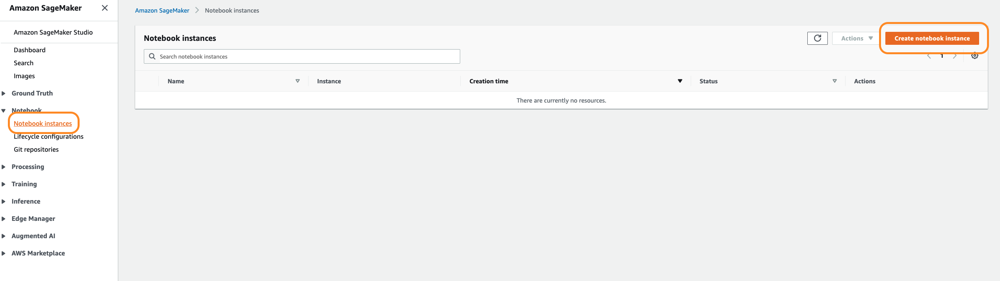
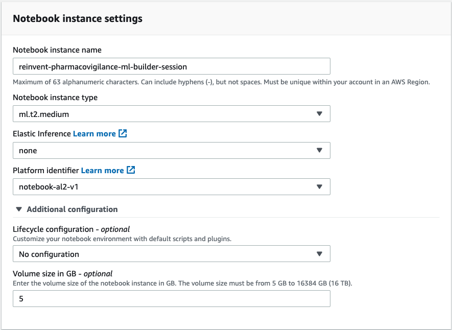
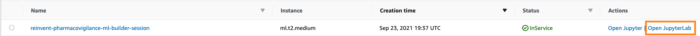
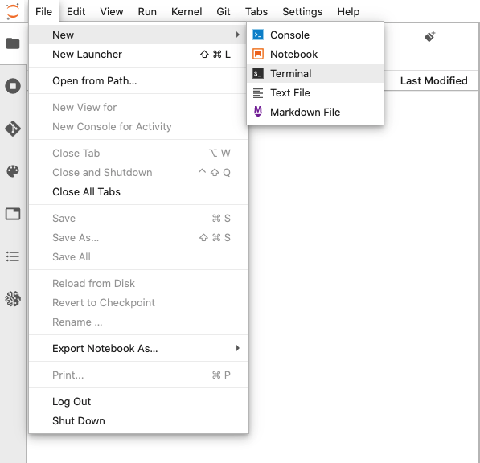

# AWS re:Invent 2021 - Smarter Pharmacovigilance with AWS Machine Learning

Social media provides an ever-increasing supply of information and users are leaning towards platforms such as Facebook and Twitter to describe their healthcare experiences. This presents another channel and opportunity for customers in Healthcare and Life Sciences to capture, investigate and report Adverse Drug Reactions (ADR) faster and in larger quantities than traditional reporting systems.

In this session, we will train and deploy a transformer-based deep learning model, using the [Amazon SageMaker and Hugging Face](https://docs.aws.amazon.com/sagemaker/latest/dg/hugging-face.html), to classify ADRs in social media data. 

# Agenda

* Introductions - Speakers and Attendees:             [5 mins]
* Use case and solution overview:                     [10 mins]
    * Identifying Adverse Drug Reaction (ADR)
    * Common challenges with datasets and the ML models
* Hands-on solution development                       [30 mins]
    * Explore the Twitter ADR dataset
    * Prepare the dataset for model training
    * Fine-tuning a pre-trained BERT model using the Amazon SageMaker HuggingFace estimator
    * Deploy the trained model to a Amazon SageMaker endpoint for inference
* Discussion, Q&A:                                    [10 mins]
* Call-to-action:                                     [5 mins]

# Repository Structure

* `images` - Images for the adverse event detection notebook
* `scripts` - Model training script
    * `train.py`
* `twitter_data_download` - Notebook to download the original dataset from Twitter
    * `data_download.ipynb`
* `adr_classify_twitter_synthetic_data.csv` - Synthetic Tweets dataset
* `create_synthetic_adr_twitter_data.ipynb` - Notebook to create synthetic tweets based on language translation
* `sagemaker_adverse_event_detection.ipynb` - Main notebook to train and deploy a model to classify adverse events

# SageMaker Notebook Instance on Event Engine

The steps below guide you how to log in through Event Engine, and set up an Amazon SageMaker notebook instance, which you can use for the builders' session.

## 1. Log in through Event Engine Portal

1. Proceed to the Event Engine Login Portal (*https://dashboard.eventengine.run/login*).

2. Enter the session's event hash code (*e.g. abcd-0123456789-ef*), and you will be directed to the login page.

3. Select your prefer login choice, you can login with Amazon account, or Email One Time Password (OTP) to gain access to the Event Page.

4. Once you have successfully login to the event, you will see a  "AWS Console" button which will federate you to the AWS Management Console. A set of STS credentials for CLI/API access are also being provided. 

## 2. Launching the Notebook Instance

1. In the upper-right corner of the AWS Management Console, confirm that you are in the AWS region of your choice.

2. Select Amazon SageMaker from the list of services. This will bring you to the Amazon SageMaker console homepage.

3. To create a new notebook instance, go to Notebook instances, and click the Create notebook instance button at the top-right of the browser window.

4.  Provide a Notebook instance name and select the `ml.t2.medium` instance for the Notebook instance type. 
For Platform identifier, select `notebook-al2-v1` to select the latest version of Amazon Linux 2. For more information on instance types, refer to the [SageMaker instance pricing documentation](https://aws.amazon.com/sagemaker/pricing/)

5. Under Permissions and encryption, for IAM role, select Create a new role. In the pop-up window, select Any S3 bucket and create the IAM role

6. Click Create notebook instance. This will take several minutes to complete.

## 3. Accessing the Notebook Instance

1. Wait for the notebook instance status to change from Pending to InService. This will take a few minutes.

2. Click Open JupyterLab, which will launch the JupyterLab homepage for your notebook instance.

## 4. Download the content for this session

1. In the top-left corner of the JupyterLab environment, select File, then New, then Terminal, to launch a new terminal within the JupyterLab environment. 
    

2. We will use this terminal to download the content for this session from github, using the git client. Inside the terminal window, type the following commands:

TODO - Link to the open-source git repository
    
3. Switch back to the Jupyter notebook home tab, you will see a new folder called `reinvent-2021-pharmacovigilance-builders-session`.

4. Launch the notebook titled `sagemaker_adverse_event_detection.ipynb` and select the `conda_pytorch_p37` kernel.

# Download the Twitter ADR dataset

The dataset has been sourced from Twitter and annotated by the Diego Lab, a Biomedical Informatics Lab at Arizona State University (ASU). In the interest of research, the Diego Lab has made a subset of data publicly available.

The tweets associated with a set of drugs were collected using the generic and brand names of the drugs, and also their possible phonetic misspellings, since it is common for user posts on Twitter to contain spelling errors. Following the collection of the data, a randomly selected sample was then chosen for annotation, which consisted of 10,822 instances. This dataset is from the year 2016, after which, certain users have either edited or deleted their tweets. The data downloaded for this session contains a total of 5,594 instances. The data was annotated by two domain experts under the guidance of a pharmacology expert. Each tweet is annotated for the presence of ADRs. For more information on the data collection and annotation process, refer to the corresponding research paper - [Portable Automatic Text Classification for Adverse Drug Reaction Detection via Multi-corpus Training](https://www.ncbi.nlm.nih.gov/pmc/articles/PMC4355323/).

Also, refer to the `twitter_data_download` that contains a script to download the dataset using the Twitter API. Refer to the [dataset link](http://diego.asu.edu/Publications/ADRClassify.html) for more information. Since, we cannot distribute the tweets as per the Twitter Privacy Policy, we create synthetic tweets that are based on the tweets annotated by the Diego Lab, a Biomedical Informatics Lab at Arizona State University (ASU). To create synthetic tweets first download the original tweets using the code in the folder `twitter_data_download`, then execute the code in the notebook `create_synthetic_adr_twitter_data.ipynb`.

## Security

See [CONTRIBUTING](CONTRIBUTING.md#security-issue-notifications) for more information.

## License

This library is licensed under the MIT-0 License. See the LICENSE file.
